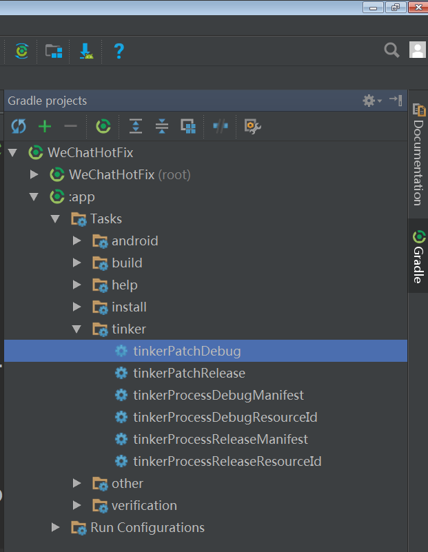
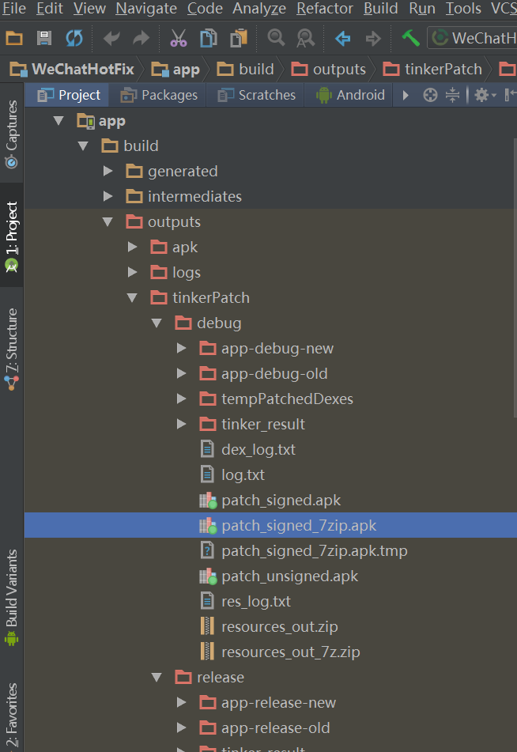

#WeChat tinker use demo
a demo for the wechat hotfix [tinker](https://github.com/Tencent/tinker).

##Getting started
1. add tinker-gradle-plugin as a dependency in your main build.gradle in the root of your project

    ```
    buildscript {
        dependencies {
            classpath ('com.tencent.tinker:tinker-patch-gradle-plugin:1.7.3')
        }
    }
    ```
2. apply the plugin in your module

    ```
    apply plugin: 'com.tencent.tinker.patch'

    /**
     * package name
     */
    def packageID
    /**
     * application class name,use in SampleApplicationLike.
     */
    def applicationName
    def oldAPKPath ="./app-release.apk"

    android {
        dexOptions {
            jumboMode = true
        }
        defaultConfig {
            applicationId packageID = "com.siyehua.wechathotfix"
            multiDexEnabled false
            // set this available if you set multiDexEnabled true
            // multiDexKeepProguard file("keep_in_main_dex.txt")
            signingConfig signingConfigs.config

            // custom field APPLICATION_NAME to BuildConfig
            // to java file can use this value
            buildConfigField "String", "APPLICATION_NAME", applicationName = "/"" + packageID + ".Siapplication" + "/""

        }
    }
    dependencies {
        //optional, help to generate the final application
        provided 'com.tencent.tinker:tinker-android-anno:1.7.3'
        //tinker's main Android lib
        compile 'com.tencent.tinker:tinker-android-lib:1.7.3'
        compile 'com.android.support:multidex:1.0.1'
    }
    tinkerPatch {

        //odd apk which your want to repair.
        oldApk = file(oldAPKPath)
        ignoreWarning = true
        useSign = true
        buildConfig {
            applyMapping = null
            applyResourceMapping = null
            tinkerId = "tinkerId"
        }

        dex {
            dexMode = "jar"
            usePreGeneratedPatchDex = false
            pattern = ["classes*.dex",
                       "assets/secondary-dex-?.jar"]
            loader = ["com.tencent.tinker.loader.*",
                      applicationName,
                      packageID + ".BaseBuildInfo"
            ]
        }

        lib {
            pattern = ["lib/armeabi/*.so"]
        }

        res {
            pattern = ["res/*", "assets/*", "resources.arsc", "AndroidManifest.xml"]
            ignoreChange = ["assets/sample_meta.txt"]
            largeModSize = 100
        }

        packageConfig {
            configField("patchMessage", "tinker is sample to use")
            configField("platform", "all")
            configField("patchVersion", "1.0")
        }

        sevenZip {
            zipArtifact = "com.tencent.mm:SevenZip:1.1.10"
        }
    }
    ```
3. create file: SampleApplicationLike

    if you have old custom application. you can copy the content to this class

    ```
    package com.siyehua.wechathotfix;

    import android.annotation.TargetApi;
    import android.app.Application;
    import android.content.Context;
    import android.content.Intent;
    import android.content.res.AssetManager;
    import android.content.res.Resources;
    import android.os.Build;
    import android.support.multidex.MultiDex;

    import com.tencent.tinker.anno.DefaultLifeCycle;
    import com.tencent.tinker.lib.tinker.TinkerInstaller;
    import com.tencent.tinker.loader.app.DefaultApplicationLike;
    import com.tencent.tinker.loader.shareutil.ShareConstants;

    /**
     * Created by siyehua on 2016/11/15.
     */
    @DefaultLifeCycle(application = BuildConfig.APPLICATION_NAME,
            flags = ShareConstants.TINKER_ENABLE_ALL,
            loadVerifyFlag = false)
    public class SampleApplicationLike extends DefaultApplicationLike {
        public SampleApplicationLike(Application application, int tinkerFlags, boolean
                tinkerLoadVerifyFlag, long applicationStartElapsedTime, long
                applicationStartMillisTime, Intent tinkerResultIntent, Resources[] resources,
                                     ClassLoader[] classLoader, AssetManager[] assetManager) {
            super(application, tinkerFlags, tinkerLoadVerifyFlag, applicationStartElapsedTime,
                    applicationStartMillisTime, tinkerResultIntent, resources, classLoader,
                    assetManager);
        }
        @Override
        public void onBaseContextAttached(Context base) {
            super.onBaseContextAttached(base);
            MultiDex.install(base);
            TinkerInstaller.install(this);
        }
        @TargetApi(Build.VERSION_CODES.ICE_CREAM_SANDWICH)
        public void registerActivityLifecycleCallbacks(Application.ActivityLifecycleCallbacks callback) {
            getApplication().registerActivityLifecycleCallbacks(callback);
        }

        @Override
        public void onCreate() {
            super.onCreate();
            //set content form your old custom application
        }
    }
    ```

4. set [AndroidManifest](./app/src/AndroidManifest.xml) application name

    ```xml
    <application
            android:name=".SampleApplication"/>
    ```

    Note: the name must equals the value: **applicationName** in the module build.gradle

#Usage
now you can use the hot fix plugin.
 * run you app to get a apk, install to your phone, copy the apk into the path **oldAPKPath**
 * repair the code
 * open the gradle window in the ide's right.

    

   selected the debug type if you run debug apk, and run this task.

   selected the release type if you run release, and run this task.

 * wait a monet, you can get the repair apk in this

    

 * copy this apk and send it to your service, user down it and restart to repair invoke this method.
    
    ```
    public void patch(View view) {
            String path = Environment.getExternalStorageDirectory().getAbsolutePath() + "/360/patch_signed_7zip.apk";
            File file = new File(path);
            if (file.exists()){
                Toast.makeText(this,"exits", Toast.LENGTH_SHORT).show();
                TinkerInstaller.onReceiveUpgradePatch(getApplicationContext(),path);
            }else{
                Toast.makeText(this,"no exits", Toast.LENGTH_SHORT).show();
            }
        }
    ```
    
    more information, you can [click](./app/src/main/java/com/siyehua/wechathotfix/MainActivity.java).

##References
https://github.com/Tencent/tinker

http://www.jianshu.com/p/75e4ebeb6b77

##License
```
Licensed under the Apache License, Version 2.0 (the "License");
you may not use this file except in compliance with the License.
You may obtain a copy of the License at

   http://www.apache.org/licenses/LICENSE-2.0

Unless required by applicable law or agreed to in writing, software
distributed under the License is distributed on an "AS IS" BASIS,
WITHOUT WARRANTIES OR CONDITIONS OF ANY KIND, either express or implied.
See the License for the specific language governing permissions and
limitations under the License.
```